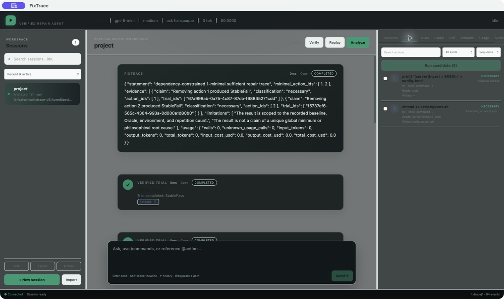
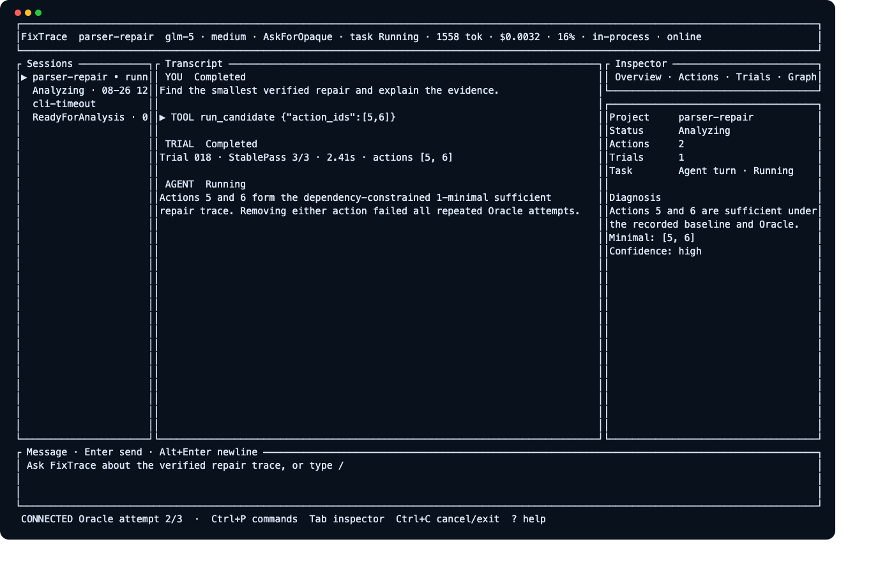
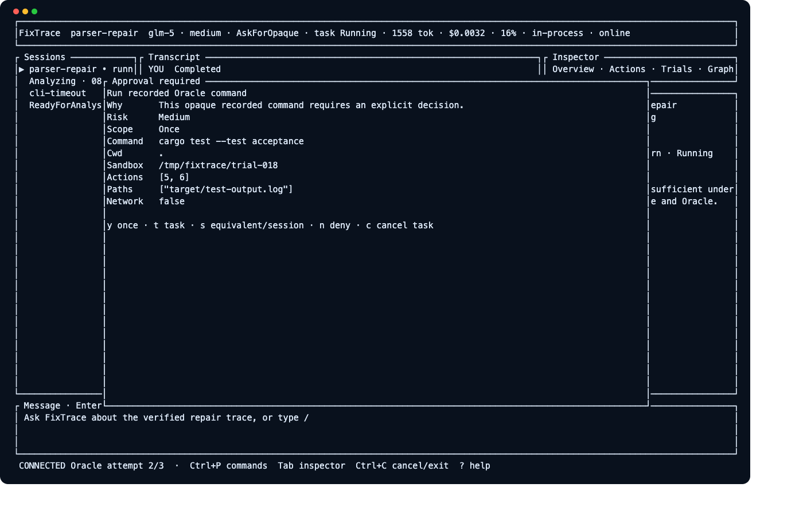
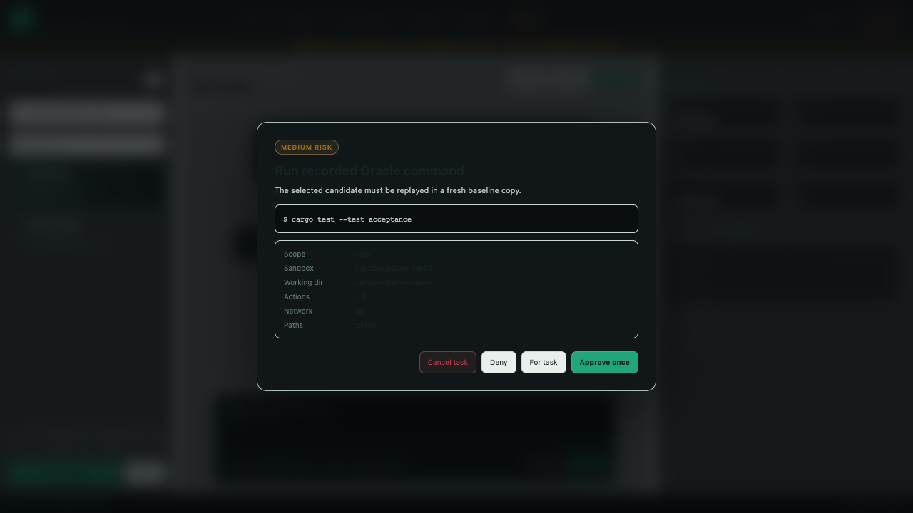
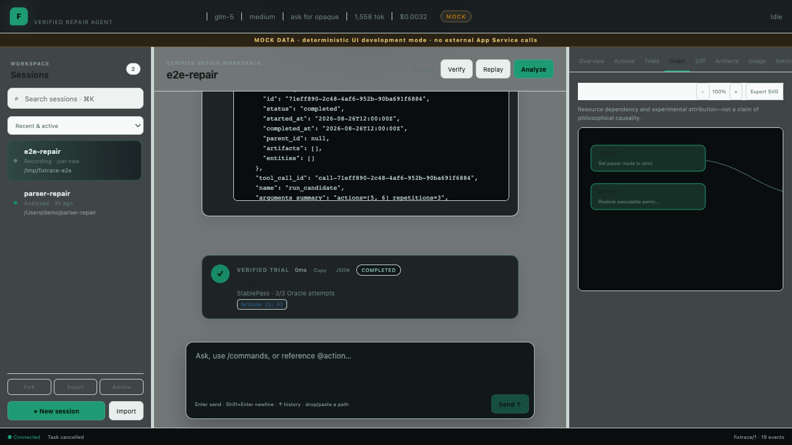
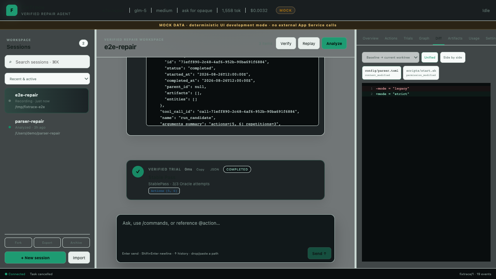

# FixTrace

FixTrace 是一个面向本地 Rust/Cargo 调试会话的可验证最小修复 Agent。它把用户的调试操作记录为有序 Action，在全新基线副本中重复重放不同候选集合，并使用用户定义的 Oracle 判断候选是否足以修复项目。

FixTrace 的准确结论是：

> 在指定基线、成功判据、环境和重复次数下，找到经过重放验证的 dependency-constrained 1-minimal sufficient repair trace。

它不会声称找到了哲学意义上的真实根因、全局最小集合或唯一最小集合。



> 上图来自打包后的原生 Tauri App，读取的是离线准备、真实重放并最小化后的 Session。

## 主要能力

- 为项目创建隔离、只读的基线和独立工作副本。
- 通过受控 REPL 记录 Shell、文件替换、环境变量和工作目录操作。
- 每个 Trial 都从全新基线副本开始，并验证 baseline hash。
- 重要候选默认重复三次，区分 StablePass、StableFail、Flaky、Unresolved 和 Cancelled。
- 推断有直接证据的资源依赖，执行 dependency-aware ddmin 和逐项消融。
- OpenAI-compatible Chat Completions Provider 与不依赖网络的 MockProvider。
- Agent 只能调用十个证据工具，不能执行模型生成的任意 Shell。
- SQLite 历史、JSON 导入导出、Token/费用统计、预算停止和 Ctrl+C 取消。
- 大于 64 KiB 的 stdout/stderr 自动保存为带 SHA-256 的 artifact，SQLite 只保留截断预览和索引。
- 统一 Rust App Service、类型化 `fixtrace/1` 协议、持久化事件流和 InProcess/stdio/WebSocket transport。
- Codex 风格全屏 TUI，以及 Tauri 2 + React 桌面 GUI；两端共享 SessionView、Approval、Cancel、Graph、Diff、Usage 和 Artifact。
- 崩溃恢复、Gap/Snapshot 恢复、跨客户端审批 CAS、10,000 Item 虚拟化和 1 MiB Artifact 范围读取。

## 环境要求

- Rust 1.93 或兼容的更新稳定工具链
- macOS 或 Linux
- 本地可运行的 Cargo 项目
- 一个确定性的非交互式 Oracle 命令
- 桌面端开发/打包需要 Node.js 22.12+ 与 npm

构建：

```bash
cargo build --release
```

安装到 Cargo bin 目录：

```bash
cargo install --path .
```

## 五分钟演示

默认 Demo 使用 MockProvider，不访问网络，也不需要 API Key：

```bash
cargo run -- demo
```

完全跳过模型循环，只运行确定性核心：

```bash
cargo run -- demo --no-llm
```

Demo 会验证：

1. 空操作集合三次均失败；
2. 九步完整轨迹三次均成功；
3. 最小充分集合恰好为 `{5, 6}`；
4. 去掉 5 或 6 的逐项消融均三次失败；
5. 最终集合再次三次通过；
6. 默认模式下 MockProvider 完成一次工具调用 Agent Loop，并输出带 action/trial 引用的 Diagnosis 和 Usage。

也可以运行 [`demo/run.sh`](demo/run.sh)。

课堂展示脚本提供四条明确路径：

```bash
./demo/presentation.sh cli       # 确定性离线核心，结论 [5, 6]
./demo/presentation.sh tui       # 自动准备真实 Session 后打开 TUI
./demo/presentation.sh desktop   # 自动准备真实 Session 后打开 Tauri dev window
./demo/presentation.sh mock-gui  # 明确标记 MOCK DATA 的确定性 GUI 展示
```

`tui`/`desktop` 使用临时状态目录，退出后自动清理；可设置 `FIXTRACE_PRESENTATION_ROOT` 保留演示状态。所有模式都不需要 API Key。

## 统一 App Service 架构

```text
CLI ─┐
TUI ─┼─ AppClient ─ fixtrace/1 ─ FixTraceAppService ─ Core workflow
GUI ─┘                       │                     ├─ SQLite/Event Store
                             └─ typed event stream └─ Artifact/LLM/Sandbox
```

CLI、TUI 和 GUI 不各自实现 replay/minimize 业务逻辑。Rust 协议类型是唯一 schema 源头，桌面端 TypeScript 由 `ts-rs` 生成；Task、Approval 和 Event sequence 的权威状态在 App Service/SQLite。App Server 支持本地 stdio 与带 capability token 的 loopback WebSocket，多客户端使用相同 catch-up/live 语义。

## 实际项目流程

创建会话：

```bash
fixtrace init /path/to/rust-project --oracle 'cargo test --test acceptance'
```

命令会输出 session ID。进入受控 REPL：

```bash
fixtrace shell <session-id>
```

REPL 支持：

```text
普通非交互式 Shell 命令
cd <project-relative-path>
export KEY=value
unset KEY
:edit <relative-path>
:checkpoint <note>
:verify
:status
:done
:quit
```

`:done` 会从全新基线重复重放完整轨迹。只有 StablePass 会让会话进入可分析状态。

运行最小化与诊断：

```bash
fixtrace analyze <session-id>
```

没有配置 API Key 时，`analyze` 自动输出确定性离线 Diagnosis。显式禁用模型：

```bash
fixtrace analyze <session-id> --no-llm
```

## 模型配置

默认配置位于 `~/.fixtrace/config.toml`。API Key 的值不能写入配置；这里只保存环境变量名。

```toml
[model]
provider = "openai-compatible"
endpoint = "https://api.openai.com/v1"
api_key_env = "FIXTRACE_API_KEY"
model = "gpt-5-mini"
api_style = "chat-completions"
context_length = 32768
reasoning_mode = "medium"
max_agent_steps = 12

[pricing]
input_per_million_usd = 0.0
output_per_million_usd = 0.0

[budget]
max_total_tokens = 100000
max_cost_usd = 1.0

[replay]
repetitions = 3
oracle_timeout_secs = 120
include_target = false
```

设置密钥和配置：

```bash
export FIXTRACE_API_KEY='your-key'
fixtrace config set model.endpoint https://example.com/v1
fixtrace config set model.model your-model
fixtrace config set pricing.input_per_million_usd 1.5
fixtrace config show
```

`model.api_key` 会被拒绝；请设置 `model.api_key_env`。

## 历史与迁移

```bash
fixtrace history list
fixtrace history show <session-id>
fixtrace show <session-id>
fixtrace export <session-id> --output session.json
fixtrace import session.json
```

导出包含会话、Actions、Trials、尝试证据、消息、工具调用、Usage、进度事件和 Diagnosis。名称包含 API_KEY、TOKEN、SECRET、PASSWORD 或 AUTHORIZATION 的环境值会被脱敏。

使用独立状态目录进行测试或隔离：

```bash
fixtrace --state-dir /tmp/my-fixtrace history list
```

也可以设置 `FIXTRACE_HOME`。

## App Server

stdio JSONL：

```bash
cargo run -p fixtrace-server -- --listen stdio
```

带 capability token 的本地 WebSocket：

```bash
cargo run -p fixtrace-server -- \
  --listen ws://127.0.0.1:4765 \
  --token-file .local/fixtrace-server.token
```

WebSocket 默认只允许 loopback，token 不进入 URL、日志、数据库或导出。协议、认证、重连和多客户端说明见 [App Server 文档](docs/app-server.md)。

## TUI

```bash
cargo run -p fixtrace-tui
cargo run -p fixtrace-tui -- --session <session-id>
```

TUI 通过 App Service 执行真实 Session/Agent/Trial/Cancel 工作流，支持流式 timeline、响应式 Sidebar/Inspector、多行输入、Slash Commands 和安全终端恢复。使用方式见 [TUI 文档](docs/tui.md)。





## Desktop GUI

安装依赖并运行真实 Tauri 窗口：

```bash
cd apps/fixtrace-desktop
npm ci
npm run tauri -- dev
```

生产打包：

```bash
npm run tauri -- build
```

macOS 输出为 `target/release/bundle/macos/FixTrace.app`。桌面端支持真实 Session 新建/恢复、Streaming、Tool/Trial、Approval/Cancel、Actions、Graph、Diff、Artifact、Usage、设置、原生文件对话框和快捷键；详见 [Desktop 文档](docs/desktop.md)。

当前仓库默认生成 ad-hoc 签名的本机开发包；公开分发还需要 Apple Developer ID、notarization 和 stapling。已执行的干净源码打包、原生 smoke test、SHA-256 与签名限制见 [U9 发布验证](docs/u9-release-verification.md)。



审批截图顶部持续显示 `MOCK DATA`，用于可重复的 UI 展示与 E2E；生产构建不会在原生调用失败后静默回退到 Mock。





## 测试与质量检查

```bash
cargo fmt --all -- --check
cargo check --workspace --all-targets
cargo test --workspace --all-targets
cargo clippy --workspace --all-targets -- -D warnings

cd apps/fixtrace-desktop
npm run typecheck
npm run lint
npm test
npm run e2e
npm run build
```

测试覆盖稳定 Snapshot、内容/权限差异、路径逃逸、环境重放、硬依赖闭包、ddmin、Flaky、cache key、费用公式、JSON 往返、取消、Mock Agent、历史记录、跨客户端恢复/审批、10k timeline、256 MiB Artifact range 以及完整 Demo。运行 `./demo/capture_screenshots.sh` 可重建 TestBackend 与显式 Mock 截图；原生截图需先运行 `./demo/presentation.sh desktop`。

## 安全边界与限制

- Trial 和候选实验只在基线副本中运行；FixTrace 不自动修改用户原项目。
- FilePatch、工作目录和内部路径 API 拒绝绝对路径、`..` 逃逸和通过符号链接写出根目录。
- Unix 子进程使用独立进程组，取消时先 SIGTERM、超时后 SIGKILL。
- LLM 只能选择当前会话已有的 Action ID，不能生成或执行新 Shell。
- 普通 Shell 由用户本人录入。MVP 不实现完整 Shell AST 或操作系统级沙箱，因此用户仍需避免系统修改、网络副作用以及指向项目外部的 Shell 重定向。
- FilePatch 当前只保存 UTF-8 普通文件；符号链接补丁和二进制编辑会报告不可重放。
- Linux/macOS 是优先平台；Windows 权限和进程组语义未完整支持。
- 不支持 SSH、apt/systemd/内核修改、GUI 录制、Docker 强依赖、strace/eBPF 或不可撤销外部 API。

## 常见问题

- `/models` 返回 400 或出现 `request failed: builder error`：先检查 endpoint 和 API Key 环境变量的首尾空白；不要把密钥值写入配置。
- App Server/GUI 报 writer lock：同一状态目录只能有一个权威写者，关闭重复 InProcess 客户端或连接已有 WebSocket server。
- TUI 所在 PTY 不支持 cursor-position query：换用常规 Terminal.app、iTerm2 或 Kitty；初始化失败时 `TerminalGuard` 会先恢复终端。
- GUI 顶部显示 `MOCK DATA`：当前是显式 Mock 开发模式；真实桌面端请使用 `npm run tauri -- dev` 或打包后的 `.app`。
- macOS 拒绝外部分发：默认 bundle 未做 Developer ID 签名/公证，详见 [排障指南](docs/troubleshooting.md)。

## 设计资料

- [实施计划](docs/implementation-plan.md)
- [设计文档](docs/design.md)
- [系统架构](docs/architecture.md)
- [UI 架构索引](docs/ui-architecture.md)
- [App Server](docs/app-server.md)
- [TUI](docs/tui.md)
- [Desktop GUI](docs/desktop.md)
- [快捷键](docs/keybindings.md)
- [UI 协议](docs/protocol.md)
- [安全模型](docs/security.md)
- [U8 稳健性与安全审计](docs/u8-hardening.md)
- [课堂演示脚本](docs/demo-script.md)
- [U9 发布验证](docs/u9-release-verification.md)
- [UI v2 Definition of Done 最终审计](docs/ui-v2-dod-audit.md)
- [常见问题](docs/troubleshooting.md)
- [课程要求映射](docs/requirements-matrix.md)
- [AI 开发开销空白模板](docs/development-cost-template.csv)

## License

MIT
