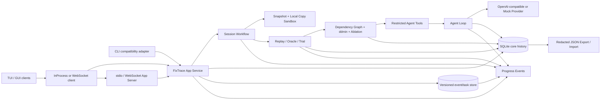
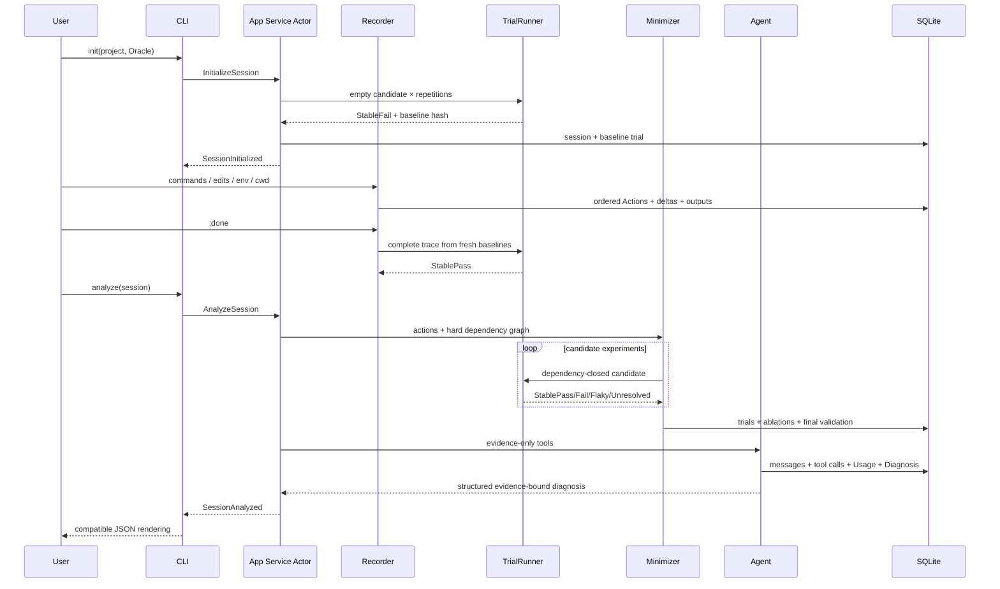

# FixTrace 系统架构

## 模块图



## 数据流



## 关键不变量

1. 所有持久化文件路径均相对项目根；绝对路径只用于本机 SessionRecord 定位，不进入 Action/Snapshot 语义。
2. 每次 Trial 创建全新目录、恢复基线原始权限并验证 root hash。
3. 候选 Action 保持原始顺序，并在执行前对硬依赖求闭包。
4. 只有 StablePass 能使 ddmin 缩减候选；Flaky 和 Unresolved 不会被当作成功。
5. 最终集合经过逐项消融和一次绕过 cache 的重复验证。
6. Provider 不持久化 API Key；Token 不可得时记录 Unknown 而非估造精确数值。
7. Agent 的 `run_candidate` 只接受当前 Session 已存在的 Action ID。
8. 客户端不直接打开数据库或调用 replay/minimize/Agent；所有状态操作先进入 App Service。

## App Service 边界（U1）

根 package 同时提供 library 和 `fixtrace` binary。`main.rs` 只负责 clap、tracing 和 Ctrl+C；`app.rs` 是保留原输出的 CLI adapter。状态操作由 `FixTraceApplication` 接口统一提交给 `FixTraceAppService`：

```text
AppCommand -> bounded mpsc -> AppServiceActor -> workflow/store/provider
                                      |
ProgressEvent <- broadcast -----------+
```

Actor 持有 StatePaths、当前配置、CancellationToken 和 event publisher。配置写入和 Session 命令在同一个应用边界内排序；调用者收到结构化 `AppResponse`，CLI 才负责打印。

U2 已加入协议入口和 task supervisor：

```text
InProcess client
  -> initialize_protocol / execute_protocol
  -> FixTraceAppService
  -> schema v2 EventStore transaction
  -> persisted EventEnvelope(sequence)
  -> bounded live broadcast
  -> catch-up + live merge in EventSubscription
```

每个 Session 最多一个 mutation task；Task 有独立 CancellationToken，运行中的命令/Trial 能由 `task/cancel` 触发清理。事件先持久化再 broadcast，订阅者用 sequence 去重，慢订阅者进入 EventGap/snapshot 恢复，而不是拖住任务。

U3 提供两个外部传输。stdio 使用 8 MiB 上限的 JSONL codec，stdout 与日志严格分离；WebSocket 使用 Axum upgrade、Bearer capability token、loopback 默认绑定和有界读写缓冲。每个外部连接各自维护 initialize/client ID 与 Session subscription，所有连接仍共享同一个 App Service、Task supervisor 和 EventStore：

```text
stdio connection ─┐
WS client A ──────┼─> typed protocol router ─> FixTraceAppService
WS client B ──────┘          │                         │
                     catch-up from SQLite <─ persist before broadcast
```

`fixtrace-client::WebSocketClient` 通过有界 channel 向 UI 交付事件；断线时指数退避，并从最后 sequence 恢复。App Server binary 在状态目录持有独占 writer lock，防止两个服务器同时成为该数据库的权威写者。传输的具体安全边界见 [App Server](app-server.md)。

受控 shell 暂时作为兼容命令由 App Service 启动，因而旧脚本无行为变化；未来 TUI/GUI 不复用其 stdin/stdout 循环，而使用 U2 的类型化 message/action 命令。

## 主要模块

| 模块 | 职责 |
|---|---|
| `domain` | Action、Snapshot、Trial、Session 等可序列化领域模型 |
| `sandbox` | 排除规则、隔离复制、只读保护、路径与符号链接边界 |
| `replay` | Action 执行、子进程证据、Oracle、重复 Trial、取消 |
| `minimize` | 资源推断、硬依赖、cache key、ddmin、消融 |
| `recorder` | 受控 REPL、编辑器、checkpoint、上下文恢复 |
| `history` | SQLite schema、artifact、脱敏导入导出 |
| `llm` | Provider trait、OpenAI-compatible HTTP、Mock、Usage/费用 |
| `agent` | 受限工具、Agent Loop、停止条件、Diagnosis 校验 |
| `application` | 统一 `AppCommand`/`AppResponse`、有界命令队列和 App Service actor |
| `app` | clap 类型到应用命令的兼容映射与 CLI 输出渲染 |
| `fixtrace-protocol` | `fixtrace/1` 的 request/response/event/timeline/approval/view 与 TS 生成 |
| `fixtrace-store` | 显式 migration、Task/Approval/Event 持久化与 catch-up |
| `fixtrace-presenter` | Rust 共享派生字段和人类可读 summary |
| `fixtrace-client` | transport-neutral AppClient、InProcess 合并和可重连 WebSocket client |
| `fixtrace-server` | initialize-first 协议路由、stdio JSONL、认证 WebSocket 与 writer lock |
| `progress` | 旧工作流进度兼容层；通过 observer 映射为持久化 AppEvent |
