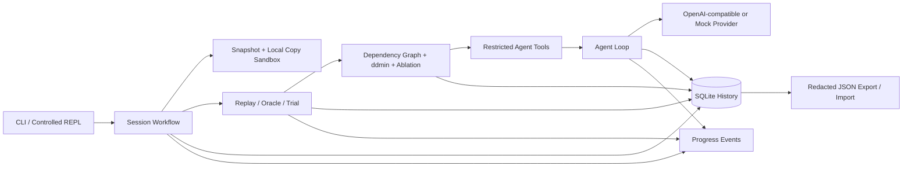
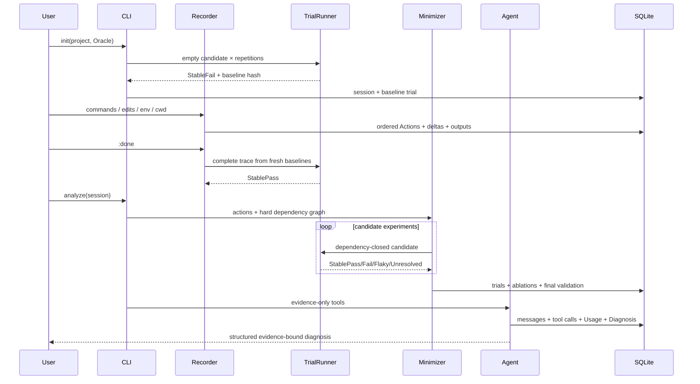

# FixTrace 系统架构

## 模块图

## 数据流

## 关键不变量

1. 所有持久化文件路径均相对项目根；绝对路径只用于本机 SessionRecord 定位，不进入 Action/Snapshot 语义。
2. 每次 Trial 创建全新目录、恢复基线原始权限并验证 root hash。
3. 候选 Action 保持原始顺序，并在执行前对硬依赖求闭包。
4. 只有 StablePass 能使 ddmin 缩减候选；Flaky 和 Unresolved 不会被当作成功。
5. 最终集合经过逐项消融和一次绕过 cache 的重复验证。
6. Provider 不持久化 API Key；Token 不可得时记录 Unknown 而非估造精确数值。
7. Agent 的 `run_candidate` 只接受当前 Session 已存在的 Action ID。

## 主要模块

| 模块 | 职责 |
|---|---|
| `domain` | Action、Snapshot、Trial、Session 等可序列化领域模型 |
| `sandbox` | 排除规则、隔离复制、只读保护、路径与符号链接边界 |
| `replay` | Action 执行、子进程证据、Oracle、重复 Trial、取消 |
| `minimize` | 资源推断、硬依赖、cache key、ddmin、消融 |
| `recorder` | 受控 REPL、编辑器、checkpoint、上下文恢复 |
| `history` | SQLite schema、artifact、脱敏导入导出 |
| `llm` | Provider trait、OpenAI-compatible HTTP、Mock、Usage/费用 |
| `agent` | 受限工具、Agent Loop、停止条件、Diagnosis 校验 |
| `progress` | 有界 mpsc 事件通道与 CLI 渲染 |

